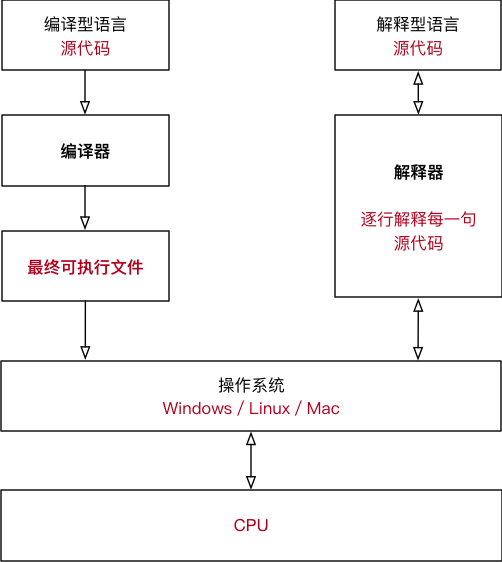

# 初识python

人生苦短，我用python --Life is short ,you need Python（python创始人  吉多*范罗苏姆  Guido van Rossum）

1. 1989 年的圣诞节期间，吉多·范罗苏姆为了在阿姆斯特丹打发时间，决心开发一个新的**解释程序**，作为 ABC 语言的一种继承（**感觉下什么叫牛人**）

2. ABC 是由吉多参加设计的一种教学语言，就吉多本人看来，ABC 这种语言非常优美和强大，是**专门为非专业程序员设计的**。但是 ABC 语言并没有成功，究其原因，吉多认为是**非开放**造成的。吉多决心在 Python 中避免这一错误，并获取了非常好的效果

3. 之所以选中 Python（蟒蛇） 作为程序的名字，是因为他是 BBC 电视剧——蒙提·派森的飞行马戏团（Monty Python's Flying Circus）的爱好者

4. 1991 年，第一个 Python **解释器** 诞生，它是用 C 语言实现的，并能够调用 C 语言的库文件

---

## 一、解释器

**计算机不能直接理解任何除机器语言以外的语言**，所以必须要把程序员所写的程序语言翻译成机器语言，计算机才能执行程序。**将其他语言翻译成机器语言的工具，被称为编译器**

编译器翻译的方式有两种：一个是**编译**，另外一个是**解释**。两种方式之间的区别在于**翻译时间点的不同**。当编译器**以解释方式运行的时候**，也称之为**解释器**

* **编译型语言**：程序在执行之前需要一个专门的编译过程，把程序编译成为机器语言的文件，运行时不需要重新翻译，直接使用编译的结果就行了。程序执行效率高，依赖编译器，跨平台性差些。如 C、C++

* **解释型语言**：解释型语言编写的程序不进行预先编译，以文本方式存储程序代码，会将代码一句一句直接运行。在发布程序时，看起来省了道编译工序，但是在运行程序的时候，必须先解释再运行
  
  编译型语言和解释型语言对比

* **速度** —— 编译型语言比解释型语言执行速度快

* **跨平台性** —— 解释型语言比编译型语言跨平台性好

---

## 二、 Python 特点

> - Python 是完全面向对象的语言
> 
> - 函数、模块、数字、字符串都是对象，在 Python 中一切皆对象
> 
> - 完全支持继承、重载、多重继承
> 
> - 支持重载运算符，也支持泛型设计
> 
> - Python 拥有一个强大的标准库，Python 语言的核心只包含数字、字符串、列表、字典、文件 等常见类型和函数，而由 Python 标准库提供了 系统管理、网络通信、文本处理、数据库接口、图形系统、XML 处理 等额外的功能
> 
> - Python 社区提供了大量的第三方模块，使用方式与标准库类似。它们的功能覆盖 科学计算、人工智能、机器学习、Web 开发、数据库接口、图形系统 多个领域

**面向对象的思维方式**

> - 面向对象 是一种 思维方式，也是一门 程序设计技术
> 
> - 要解决一个问题前，首先考虑 由谁 来做，怎么做事情是 谁 的职责，最后把事情做好就行！
> 
> - 对象 就是 谁
> 
> - 要解决复杂的问题，就可以找多个不同的对象，各司其职，共同实现，最终完成需求

 **优点**

> - 简单、易学
> 
> - 免费、开源
> 
> - 面向对象
> 
> - 丰富的库
> 
> - 可扩展性
> 
> - 如果需要一段关键代码运行得更快或者希望某些算法不公开，可以把这部分程序用 C 或 C++ 编写，然后在 Python程序中使用它们
> 
> - ……

**缺点**

> - 运行速度
> 
> - 国内市场较小
> 
> - 中文资料匮乏

---

## 三、执行 Python 程序的三种方式

#### 1.解释器 python / python3

##### (1)Python 的解释器

 使用 python 2.x 解释器 python xxx.py

使用 python 3.x 解释器 python3 xxx.py 

##### (2)其他解释器（知道）

Python 的解释器 如今有多个语言的实现，包括：

- CPython —— 官方版本的 C 语言实现

- Jython —— 可以运行在 Java 平台

- IronPython —— 可以运行在 .NET 和 Mono 平台

- PyPy —— Python 实现的，支持 JIT 即时编译

#### 2.交互式运行 Python 程序

- 直接在终端中运行解释器，而不输入要执行的文件名

- 在 Python 的 Shell 中直接输入 Python 的代码，会立即看到程序执行结果

##### (1)交互式运行 Python 的优缺点

 优点

- 适合于学习/验证 Python 语法或者局部代码
  
  缺点

- 代码不能保存

- 不适合运行太大的程序

- 

##### (2)退出 官方的解释器

 1> 直接输入 exit()

 2> 使用热键退出

在 python 解释器中，按热键 ctrl + d 可以退出解释器

##### (3)IPython

- IPython 中 的 “I” 代表 交互 interactive

**特点**

> - IPython 是一个 python 的 交互式 shell，比默认的 python shell 好用得多
> 
> - 支持自动补全
> 
> - 自动缩进
> 
> - 支持 bash shell 命令
> 
> - 内置了许多很有用的功能和函数
> 
> - IPython 是基于 BSD 开源的

 **版本**

> - Python 2.x 使用的解释器是 ipython
> 
> - Python 3.x 使用的解释器是 ipython3
> 
> - 要退出解释器可以有以下两种方式：

 1> 直接输入 exit

python In [1]: exit

 2> 使用热键退出

在 IPython 解释器中，按热键 ctrl + d，IPython 会询问是否退出解释器

> IPython 的安装
> 
> bash $ sudo apt install ipython

#### 3.Python 的 IDE —— PyCharm

##### (1)集成开发环境（IDE）

集成开发环境（IDE，Integrated Development Environment）—— 集成了开发软件需要的所有工具，一般包括以下工具：

- 图形用户界面

- 代码编辑器（支持 代码补全／自动缩进）

- 编译器／解释器

- 调试器（断点／单步执行）

- ……

---

## 四、程序执行的原理

1. 程序 运行之前，程序是 保存在硬盘 中的

2. 当要运行一个程序时
- 操作系统会首先让 CPU 把程序复制到 内存 中

- CPU 执行 内存 中的 程序代码

> 程序要执行，首先要被加载到内存

 **Python 程序执行原理**

> 1. 操作系统会首先让 CPU 把 Python 解释器 的程序复制到 内存 中
> 
> 2. Python 解释器 根据语法规则，从上向下 让 CPU 翻译 Python 程序中的代码
> 
> 3. CPU 负责执行翻译完成的代码

**Python 的解释器有多大**

 执行以下终端命令可以查看 Python 解释器的大小

    #1. 确认解释器所在位置
    
    $ which python
    
    # 2. 查看 python 文件大小(只是一个软链接)
    
    $ ls -lh /usr/bin/python
    
    # 3. 查看具体文件大小
    
    $ ls -lh /usr/bin/python2.7    #3.4m

 提示：建立 软链接 的目的，是为了方便使用者不用记住使用的解释器是 哪一个具体版本
