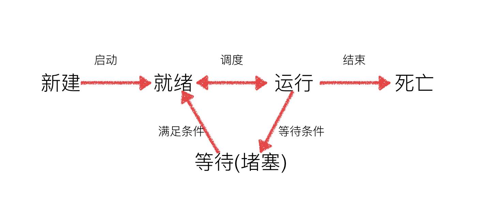

# 多进程

## 一、 进程的状态（好好学操作系统）

工作中，任务数往往大于cpu的核数，即一定有一些任务正在执行，而另外一些任务在等待cpu进行执行，因此导致了有了不同的状态



- 就绪态：运行的条件都已经慢去，正在等在cpu执行
- 执行态：cpu正在执行其功能
- 等待态：等待某些条件满足，例如一个程序sleep了，此时就处于等待态

## 二、创建进程

### 1.创建方法和线程一样

```py
# -*- coding:utf-8 -*-
from multiprocessing import Process
import time


def run_proc():
    """子进程要执行的代码"""
    while True:
        print("----2----")
        time.sleep(1)


if __name__=='__main__':
    p = Process(target=run_proc)
    p.start()
    while True:
        print("----1----")
        time.sleep(1)
```

### 2.Process语法结构如下：

Process([group [, target [, name [, args [, kwargs]]]]])

- target：如果传递了函数的引用，可以任务这个子进程就执行这里的代码
- args：给target指定的函数传递的参数，以元组的方式传递
- kwargs：给target指定的函数传递命名参数
- name：给进程设定一个名字，可以不设定
- group：指定进程组，大多数情况下用不到

Process创建的实例对象的常用方法：

- start()：启动子进程实例（创建子进程）
- is_alive()：判断进程子进程是否还在活着
- join([timeout])：是否等待子进程执行结束，或等待多少秒
- terminate()：不管任务是否完成，立即终止子进程

### 3. 给子进程指定的函数传递参数

```py
# -*- coding:utf-8 -*-
from multiprocessing import Process
import os
from time import sleep


def run_proc(name, age, **kwargs):
    for i in range(10):
        print('子进程运行中，name= %s,age=%d ,pid=%d...' % (name, age, os.getpid()))
        print(kwargs)
        sleep(0.2)

if __name__=='__main__':
    p = Process(target=run_proc, args=('test',18), kwargs={"m":20})
    p.start()
    sleep(1)  # 1秒中之后，立即结束子进程
    p.terminate()
    p.join()
```

## 三、进程的pid name

```py
# -*- coding:utf-8 -*-
from multiprocessing import Process
import os
import time

def run_proc():
    """子进程要执行的代码"""
    print('子进程运行中，pid=%d...' % os.getpid())  # os.getpid获取当前进程的进程号
    print('子进程将要结束...')

if __name__ == '__main__':
    print('父进程pid: %d' % os.getpid())  # os.getpid获取当前进程的进程号
    p = Process(target=run_proc)
    p.start()
```

- name：当前进程的别名，默认为Process-N，N为从1开始递增的整数
- pid：当前进程的pid（进程号）
- 在子进程中**os.getppid()**，可以得到父进程的pid

## 四、关于全局变量

### 1.多进程 可以用全局变量 但是 不共享全局变量

- 就是说可以拿来用，也可以改，但是在这里不管怎么改，别的进程拿的还是原来的

```py
# -*- coding:utf-8 -*-
from multiprocessing import Process
import os
import time

nums = [11, 22]

def work1():
    """子进程要执行的代码"""
    print("in process1 pid=%d ,nums=%s" % (os.getpid(), nums))
    for i in range(3):
        nums.append(i)
        time.sleep(1)
        print("in process1 pid=%d ,nums=%s" % (os.getpid(), nums))

def work2():
    """子进程要执行的代码"""
    print("in process2 pid=%d ,nums=%s" % (os.getpid(), nums))

if __name__ == '__main__':
    p1 = Process(target=work1)
    p1.start()
    p1.join()

    p2 = Process(target=work2)
    p2.start()
```

 运行结果:

```py
in process1 pid=11349 ,nums=[11, 22]
in process1 pid=11349 ,nums=[11, 22, 0]
in process1 pid=11349 ,nums=[11, 22, 0, 1]
in process1 pid=11349 ,nums=[11, 22, 0, 1, 2]
in process2 pid=11350 ,nums=[11, 22]
```

### 2.Queue

Queue就是队列，**先进先出**，但这个是普通的queue

```py
import queue
q = queue.Queue()
q.put("123")
while not q.empyt():
    num = q.get()
```

我们要使用multiprocessing模块的Queue实现多进程之间的数据传递

初始化Queue()对象时（例如：q=Queue()），若括号中没有指定最大可接收的消息数量，或数量为负值，那么就代表可接受的消息数量没有上限（直到内存的尽头）；

- Queue.qsize()：返回当前队列包含的消息数量；

- Queue.empty()：如果队列为空，返回True，反之False ；

- Queue.full()：如果队列满了，返回True,反之False；

- Queue.get([block[, timeout]])：获取队列中的一条消息，然后将其从列队中移除，block默认值为True；

1）如果block使用默认值，且没有设置timeout（单位秒），消息列队如果为空，此时程序将被阻塞（停在读取状态），直到从消息列队读到消息为止，如果设置了timeout，则会等待timeout秒，若还没读取到任何消息，则抛出"Queue.Empty"异常；

2）如果block值为False，消息列队如果为空，则会立刻抛出"Queue.Empty"异常；

- Queue.get_nowait()：相当Queue.get(False)；

- Queue.put(item,[block[, timeout]])：将item消息写入队列，block默认值为True；

1）如果block使用默认值，且没有设置timeout（单位秒），消息列队如果已经没有空间可写入，此时程序将被阻塞（停在写入状态），直到从消息列队腾出空间为止，如果设置了timeout，则会等待timeout秒，若还没空间，则抛出"Queue.Full"异常；

2）如果block值为False，消息列队如果没有空间可写入，则会立刻抛出"Queue.Full"异常；

- Queue.put_nowait(item)：相当Queue.put(item, False)；

### 3.用Queue实现进程全局变量

代码在进程池pool那里   没有进程池的情况我们用multiprocessing模块的Queue

## 五、进程池pool

### 1.创建进程池

当需要创建的子进程数量不多时，可以直接利用multiprocessing中的Process动态成生多个进程，但如果是上百甚至上千个目标，手动的去创建进程的工作量巨大，此时就可以用到multiprocessing模块提供的Pool方法。

初始化Pool时，可以指定一个最大进程数，当有新的请求提交到Pool中时，如果池还没有满，那么就会创建一个新的进程用来执行该请求；但如果池中的进程数已经达到指定的最大值，那么该请求就会等待，直到池中有进程结束，才会用之前的进程来执行新的任务，请看下面的实例：

```py
# -*- coding:utf-8 -*-
from multiprocessing import Pool
import os, time, random

def worker(msg):
    t_start = time.time()
    print("%s开始执行,进程号为%d" % (msg,os.getpid()))
    # random.random()随机生成0~1之间的浮点数
    time.sleep(random.random()*2) 
    t_stop = time.time()
    print(msg,"执行完毕，耗时%0.2f" % (t_stop-t_start))

po = Pool(3)  # 定义一个进程池，最大进程数3
for i in range(0,10):
    # Pool().apply_async(要调用的目标,(传递给目标的参数元祖,))
    # 每次循环将会用空闲出来的子进程去调用目标
    # 进程池只有3进程  ，但是他可以接受很多进程，多出来的存到自己的队列里面
    # 等  那3个【运行中】的进程结束，再把队列的进程放上去运行
    po.apply_async(worker,(i,))

print("----start----")
po.close()  # 关闭进程池，关闭后po不再接收新的请求
po.join()  # 等待po中所有子进程执行完成，必须放在close语句之后
print("-----end-----")
```

multiprocessing.Pool常用函数解析：

- apply_async(func[, args[, kwds]]) ：使用非阻塞方式调用func（并行执行，堵塞方式必须等待上一个进程退出才能执行下一个进程），args为传递给func的参数列表，kwds为传递给func的关键字参数列表；
- close()：关闭Pool，使其不再接受新的任务；
- terminate()：不管任务是否完成，立即终止；
- join()：主进程阻塞，等待子进程的退出， 必须在close或terminate之后使用；

### 2.进程池使用Queue

如果要使用Pool创建进程，就需要使用**multiprocessing.Manager()**中的Queue()，而不是multiprocessing.Queue()，否则会得到一条如下的错误信息：

RuntimeError: Queue objects should only be shared between processes through inheritance.

```py
# -*- coding:utf-8 -*-

# 修改import中的Queue为Manager
from multiprocessing import Manager,Pool
import os,time,random

def reader(q):
    print("reader启动(%s),父进程为(%s)" % (os.getpid(), os.getppid()))
    for i in range(q.qsize()):
        print("reader从Queue获取到消息：%s" % q.get(True))

def writer(q):
    print("writer启动(%s),父进程为(%s)" % (os.getpid(), os.getppid()))
    for i in "itcast":
        q.put(i)

if __name__=="__main__":
    print("(%s) start" % os.getpid())
    q = Manager().Queue()  # 使用Manager中的Queue
    po = Pool()
    po.apply_async(writer, (q,))

    time.sleep(1)  # 先让上面的任务向Queue存入数据，然后再让下面的任务开始从中取数据

    po.apply_async(reader, (q,))
    po.close()
    po.join()
    print("(%s) End" % os.getpid())
```
