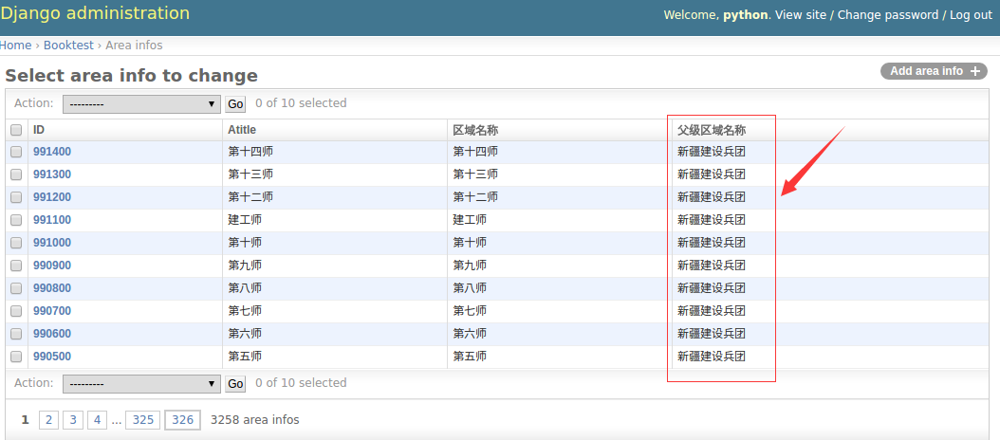
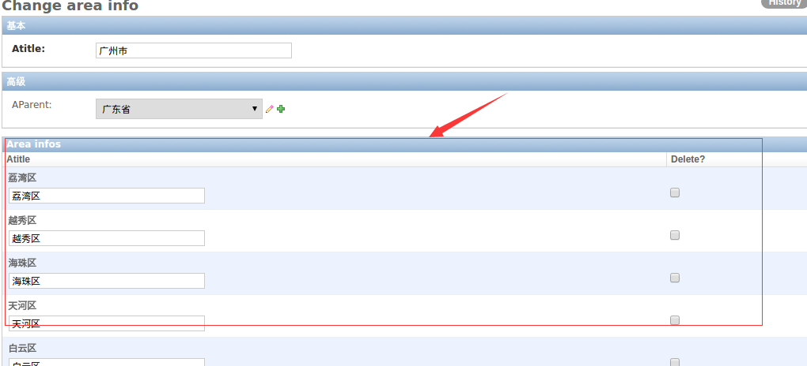
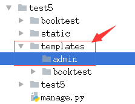
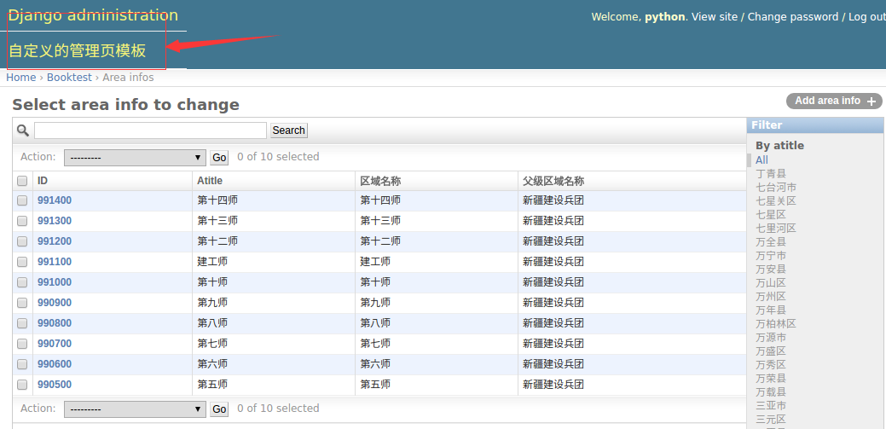

---

## 初始操作

#### 1.本地化 (语言和时区)

项目文件下的setting.py

```py
# LANGUAGE_CODE = 'en-us'  英文
LANGUAGE_CODE = 'zh-hans'    # 指定语言（注意不要写错，否则无法启动服务器） 中文

# TIME_ZONE = 'UTC'
TIME_ZONE = 'Asia/Shanghai'  # 指定时间  没有北京时间  只有上海
```

#### 2.创建登录后台的管理员

    python manage.py createsuperuser

> 接下来是输入管理员名字、邮箱、密码
> 邮箱目前没发现有什么用

#### 3.注册模型类

管理类有两种使用方式：

- 注册参数
- 装饰器

在APP目录下的admin.py中注册模型类：告诉djang框架，根据注册的模型类来生成对应表管理页面：

注册参数：

```py
# app01/admin.py:
from app01.models import Department, Employee

#没有模型管理类直接注册  就会根据这些类的数据生成默认的页面
# 注册Model类
admin.site.register(Department)
admin.site.register(Employee)
```

> 要注册的类就是 models里面创建的连接数据库的类

装饰器：打开booktest/admin.py文件，在管理类上注册模型类，代码如下：

要在模型管理类中使用装饰器

```
@admin.register(AreaInfo)
class AreaAdmin(admin.ModelAdmin):
    pass
```

#### 4.启动服务器：

```
python manage.py runserver
```

在浏览器上输入以下地址，进入管理后台，对数据库表数据进行管理:

```
http://127.0.0.1:8000/admin
```

#### 5.模型管理类

自定义模型管理类，作用：告诉django在生成的管理页面上显示哪些内容。

之前03创建模型基础 中给了 一套默认 的admin界面 微调的方法

下面是完全自定义admin界面的方法

APP目录下的 admin.py

```py
# 1.创建模型管理类
class DepartmentAdmin(admin.ModelAdmin):
    # 指定后台网页要显示的字段
    list_display = ["id", "name", "create_date"]


class EmployeeAdmin(admin.ModelAdmin):
    # 指定后台网页要显示的字段
    list_display = ["id", "name", "age", "sex", "comment"]


# 2.在注册Model类时   绑定类和 管理类
admin.site.register(Department, DepartmentAdmin)
```

---

## 模型管理类的更多参数

#### 列表页选项

###### 页大小

每页中显示多少条数据，默认为每页显示100条数据，属性如下：

```
list_per_page=100
```

1）打开booktest/admin.py文件，修改AreaAdmin类如下：

```
class AreaAdmin(admin.ModelAdmin):
    list_per_page = 10
```

2）在浏览器中查看区域信息的列表页面，效果如下图：

.png)

###### "操作选项"的位置

顶部显示的属性，设置为True在顶部显示，设置为False不在顶部显示，默认为True。

```
actions_on_top=True
```

底部显示的属性，设置为True在底部显示，设置为False不在底部显示，默认为False。

```
actions_on_bottom=False
```

1）打开booktest/admin.py文件，修改AreaAdmin类如下：

```
class AreaAdmin(admin.ModelAdmin):
    ...
    actions_on_top = True
    actions_on_bottom = True
```

2）在浏览器中刷新效果如下图：

.png)

#### 列表中的列

属性如下：

```
list_display=[模型字段1,模型字段2,...]
```

1）打开booktest/admin.py文件，修改AreaAdmin类如下：

```
class AreaAdmin(admin.ModelAdmin):
    ...
    list_display = ['id','atitle']
```

2）在浏览器中刷新效果如下图：

.png)

点击列头可以进行升序或降序排列。

###### 将方法作为列

列可以是模型字段，还可以是模型方法，要求方法有返回值。

1）打开booktest/models.py文件，修改AreaInfo类如下：

```
class AreaInfo(models.Model):
    ...
    def title(self):
        return self.atitle
```

2）打开booktest/admin.py文件，修改AreaAdmin类如下：

```
class AreaAdmin(admin.ModelAdmin):
    ...
    list_display = ['id','atitle','title']
```

3）在浏览器中刷新效果如下图：


方法列是不能排序的，如果需要排序需要为方法指定排序依据。

```
admin_order_field=模型类字段
```

1）打开booktest/models.py文件，修改AreaInfo类如下：

```
class AreaInfo(models.Model):
    ...
    def title(self):
        return self.atitle
    title.admin_order_field='atitle'
```

2）在浏览器中刷新效果如下图：


###### 列标题

列标题默认为属性或方法的名称，可以通过属性设置。需要先将模型字段封装成方法，再对方法使用这个属性，模型字段不能直接使用这个属性。

```
short_description='列标题'
```

1）打开booktest/models.py文件，修改AreaInfo类如下：

```
class AreaInfo(models.Model):
    ...
    title.short_description='区域名称'
```

2）在浏览器中刷新效果如下图：


###### 关联对象

无法直接访问关联对象的属性或方法，可以在模型类中封装方法，访问关联对象的成员。

1）打开booktest/models.py文件，修改AreaInfo类如下：

```
class AreaInfo(models.Model):
    ...
    def parent(self):
        if self.aParent is None:
          return ''
        return self.aParent.atitle
    parent.short_description='父级区域名称'
```

2）打开booktest/admin.py文件，修改AreaAdmin类如下：

```
class AreaAdmin(admin.ModelAdmin):
    ...
    list_display = ['id','atitle','title','parent']
```

3）在浏览器中刷新效果如下图：



#### 右侧栏过滤器

属性如下，只能接收字段，会将对应字段的值列出来，用于快速过滤。一般用于有重复值的字段。

```
list_filter=[]
```

1）打开booktest/admin.py文件，修改AreaAdmin类如下：

```
class AreaAdmin(admin.ModelAdmin):
    ...
    list_filter=['atitle']
```

2）在浏览器中刷新效果如下图：


#### 搜索框

属性如下，用于对指定字段的值进行搜索，支持模糊查询。列表类型，表示在这些字段上进行搜索。

```
search_fields=[]
```

1）打开booktest/admin.py文件，修改AreaAdmin类如下：

```
class AreaAdmin(admin.ModelAdmin):
    ...
    search_fields=['atitle']
```

2）在浏览器中刷新效果如下图：


#### 中文标题

1）打开booktest/models.py文件，修改模型类，为属性指定verbose_name参数，即第一个参数。

```
class AreaInfo(models.Model):
    atitle=models.CharField('标题',max_length=30)#名称
    ...
```

2）在浏览器中刷新效果如下图：


## 编辑页选项

#### 显示字段顺序

属性如下：

```
fields=[]
```

1）点击某行ID的链接，可以转到修改页面，默认效果如下图：


2）打开booktest/admin.py文件，修改AreaAdmin类如下：

```
class AreaAdmin(admin.ModelAdmin):
    ...
    fields=['aParent','atitle']
```

3）刷新浏览器效果如下图：


在下拉列表中输出的是对象的名称，可以在模型类中定义str方法用于对象转换字符串。

1）打开booktest/models.py文件，修改AreaInfo类，添加str方法。

```
class AreaInfo(models.Model):
    ...
    def __str__(self):
        return self.atitle
```

2）刷新浏览器效果如下图：


#### 分组显示

属性如下：

```
fieldset=(
    ('组1标题',{'fields':('字段1','字段2')}),
    ('组2标题',{'fields':('字段3','字段4')}),
)
```

1）打开booktest/admin.py文件，修改AreaAdmin类如下：

```
class AreaAdmin(admin.ModelAdmin):
    ...
    # fields=['aParent','atitle']
    fieldsets = (
        ('基本', {'fields': ['atitle']}),
        ('高级', {'fields': ['aParent']})
    )
```

2）刷新浏览器效果如下图：


> 说明：fields与fieldsets两者选一使用。

#### 关联对象

在一对多的关系中，可以在一端的编辑页面中编辑多端的对象，嵌入多端对象的方式包括表格、块两种。 类型InlineModelAdmin：表示在模型的编辑页面嵌入关联模型的编辑。子类TabularInline：以表格的形式嵌入。子类StackedInline：以块的形式嵌入。

1）打开booktest/admin.py文件，创建AreaStackedInline类。

```
class AreaStackedInline(admin.StackedInline):
    model = AreaInfo#关联子对象
    extra = 2#额外编辑2个子对象
```

2）打开booktest/admin.py文件，修改AreaAdmin类如下：

```
class AreaAdmin(admin.ModelAdmin):
    ...
    inlines = [AreaStackedInline]
```

3）刷新浏览器效果如下图：


可以用表格的形式嵌入。

1）打开booktest/admin.py文件，创建AreaTabularInline类。

```
class AreaTabularInline(admin.TabularInline):
    model = AreaInfo#关联子对象
    extra = 2#额外编辑2个子对象
```

2）打开booktest/admin.py文件，修改AreaAdmin类如下：

```
class AreaAdmin(admin.ModelAdmin):
    ...
    inlines = [AreaTabularInline]
```

3）刷新浏览器效果如下图：



## 重写模板

1）在templates/目录下创建admin目录，结构如下图：



2）打开当前虚拟环境中Django的目录，再向下找到admin的模板，目录如下：

```
/home/python/.virtualenvs/py_django/lib/python3.5/site-packages/django/contrib/admin/templates/admin
```

3）将需要更改文件拷贝到第一步建好的目录里，此处以base_site.html为例。


编辑base_site.html文件：

```


{{ title }} | {{ site_title|default:_('Django site admin') }}


<h1 id="site-name"><a href="">{{ site_header|default:_('Django administration') }}</a></h1>
<hr>
<h1>自定义的管理页模板</h1>
<hr>



```

4）在浏览器中转到列表页面，刷新后如下图：



其它后台的模板可以按照相同的方式进行修改。