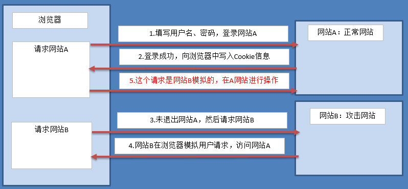
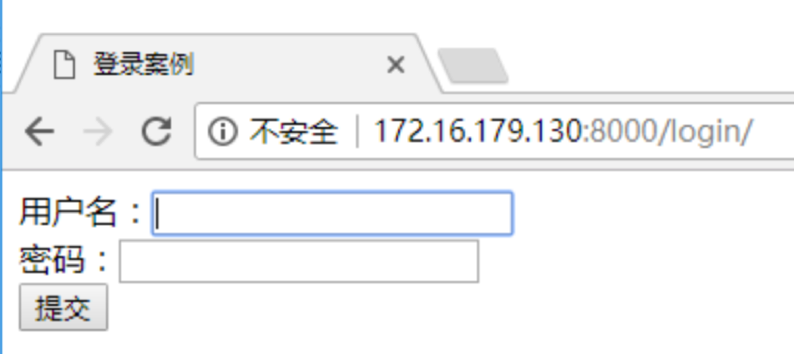
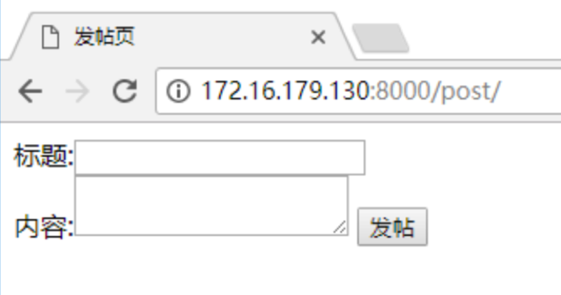
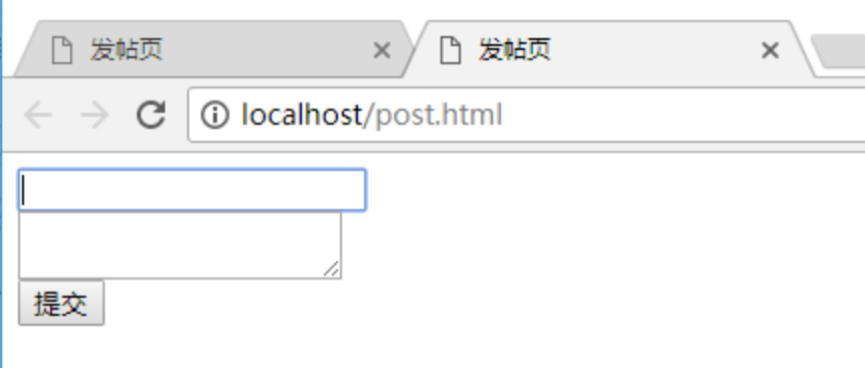
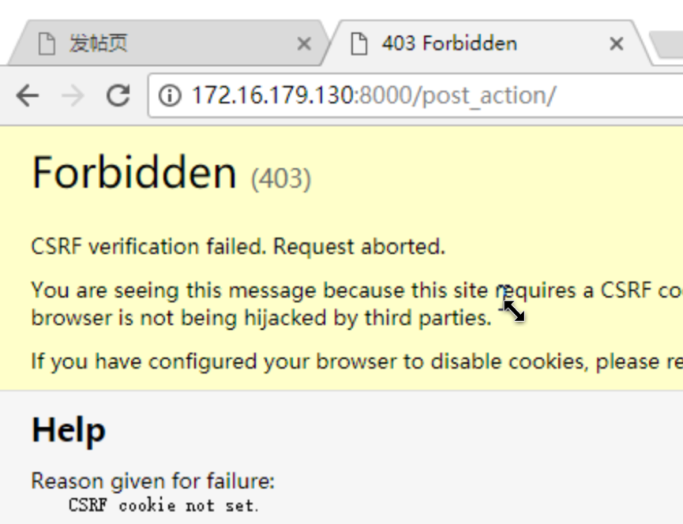
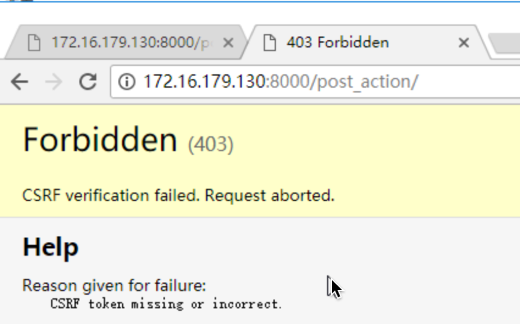

## 登录装饰器

在django开发的过程中，有框架自带的登录装饰器，

登陆装饰器的作用是，在各个页面检测是否已登陆，某些页面需要登陆才允许访问，这些检验方法都是一样的，就搞个装饰器

```python
from django.contrib.auth.decorators import login_required
```

@login_required
但是这个登录装饰器有一定的不方便的地方，这里不在此进行说明。

在后续的开发过程中，这个登录装饰器已经不满足开发的需求，下面是我学习开发过程中写的一个装饰器，比以前的装饰器多了一些重定向的功能

```python
from django.shortcuts import redirect,reverse
from django.http import JsonResponse
def login_decorator(func):
    def inner(request,*args,**kwargs):
        if request.user.is_authenticated():
            return func(request,*args,**kwargs)
        else:
            if request.is_ajax():
                return JsonResponse({'status':'nologin'})
            #拿到目前访问的完整url，不只是路径部分
            url = request.get_full_path()
            ret = redirect(reverse('users:user_login'))
            ret.set_cookie('url',url)
            return ret
    return inner

 
```

## CSRF

CSRF全拼为Cross Site Request Forgery，译为跨站请求伪造。CSRF指攻击者盗用了你的身份，以你的名义发送恶意请求。CSRF能够做的事情包括：以你名义发送邮件，发消息，盗取你的账号，甚至于购买商品，虚拟货币转账......造成的问题包括：个人隐私泄露以及财产安全。

CSRF示意图如下：



如果想防止CSRF，首先是重要的信息传递都采用POST方式而不是GET方式，接下来就说POST请求的攻击方式以及在Django中的避免。

#### 示例

攻击过程的操作了解即可，不需要重现。

1）打开booktest/views.py文件，创建视图login，login_check, post和post_action。

```python
def login(reqeust):
    return render(reqeust, 'booktest/login.html')

def login_check(request):
    username = request.POST.get('username') #获取用户名
    password = request.POST.get('password') #获取密码

    # 校验
    if username == 'smart' and password == '123':
        request.session['username']=name #记住登录用户名
        request.session['islogin']=True　#判断用户是否已登录
        return redirect('/post/')
    else:
        return redirect('／login/')

def post(request):
    return render(request, 'booktest/post.html')

def post_action(request):
    if request.session['islogin']:
        username = request.session['username']
        return HttpResponse('用户'+username+'发了一篇帖子')
    else:
        return HttpResponse('发帖失败')
```

2）打开booktest/urls.py文件，配置url。

```python
url(r'^login/$', views.login),
url(r'^login_check/$', views.login_check),
url(r'^post/$', views.post),
url(r'^post_action/$',views.post_action),
```

3）在templates/booktest/目录下创建login.html和post.html。

```python
<!DOCTYPE html>
<html lang="en">
<head>
    <meta charset="UTF-8">
    <title>登录案例</title>
</head>
<body>
<form method="post" action="/login_check/">
    用户名：<input type="text" name="username"/><br/>
    密码：<input type="password" name="password"/><br/>
    <input type="submit" value="提交"/>
</form>
</body>
</html>
<!DOCTYPE html>
<html lang="en">
<head>
    <meta charset="UTF-8">
    <title>发帖页</title>
</head>
<body>
<form method="post" action="/post_action/">
    标题:<input type="text" name="title"/><br/>
    内容:<textarea name="content"></textarea>
    <input type="submit" value="发帖"/>
</form>
</body>
</html>
```

4）启动运行服务器，采用IP的方式，因为要演示其它IP的请求。

```
python manage.py runserver 172.16.179.130:8000
```

5）回到windows中，在浏览器中输入如下网址，将这个标签称为网站A。

```
http://172.16.179.130:8000/login/
```

浏览效果如下图：



输入用户名和密码，点击登录，效果如下图：



6）下面使用windows中的IIS服务器模拟另外一个网站，创建post.html，复制templates/booktest/post.html内容，并修改action路径。

```html
<html>
<head>
    <title>发帖页</title>
</head>
<body>
<form method="post" action="http://172.16.179.130:8000/post_action/">
  标题:<input type="text" name="title"/><br/>
  内容:<textarea name="content"></textarea>
  <input type="submit" value="发帖"/>
</form>
</body>
</html>
```

7）在windows中浏览器查看效果如下图，将这个标签称为网站B。



8）Django项目中默认启用了csrf保护，现在先禁用，打开test4/settings.py文件，注释掉csrf中间件。


9）点击游览器的第一个标签即网站A，点击"发帖"按钮后如下图：


10）点击游览器的第二个标签即IIS网站B，点击“发帖”按钮后如下图：


对比上面两张图，发现无论从网站A还是网站B都可以访问网站A的post_action视图，这就是不安全的。

#### 防止CSRF

1）Django提供了csrf中间件用于防止CSRF攻击，只需要在test4/settings.py中启用csrf中间件即可。


2）回到windows浏览器中，分别在网站A、网站B中点击“提交”按钮，效果一样，如下图：



3）这下麻烦了，因为网站A自己也不能访问了，接下来templates/booktest/post.html内容，在form表单中使用标签csrf_token。

```
<!DOCTYPE html>
<html lang="en">
<head>
    <meta charset="UTF-8">
    <title>发帖页</title>
</head>
<body>
<form method="post" action="/post_action/">
    
    标题:<input type="text" name="title"/><br/>
    内容:<textarea name="content"></textarea>
    <input type="submit" value="发帖"/>
</form>
</body>
</html>
```

4）回到windows浏览器中，在网站A中点击“提交”按钮，效果如下图：


5）回到windows浏览器中，在网站B中点击“提交”按钮，效果如下图：



好了，Django中成功完成CSRF防护。

#### 总结

- 以上的演示过程了解即可，不需要重现，以下的内容是重点，必须记住
- 重要信息如金额、积分等，采用POST方式传递
- 启用CSRF中间件，默认启用
- 在form表单中post提交时加入标签csrf_token

#### 保护原理

加入标签后，可以查看post.html的源代码，发现多了一个隐藏域。

> 了解原理即可。


在浏览器的“开发者工具”中查看cookie信息。


说明：当启用中间件并加入标签csrf_token后，会向客户端浏览器中写入一条Cookie信息，这条信息的值与隐藏域input元素的value属性是一致的，提交到服务器后会先由csrf中间件进行验证，如果对比失败则返回403页面，而不会进行后续的处理。