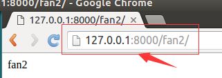
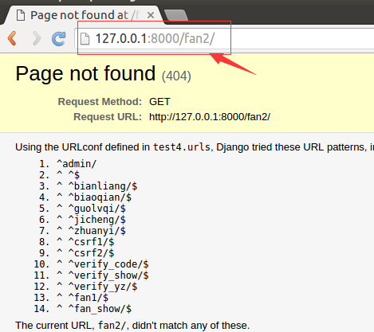
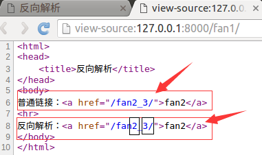
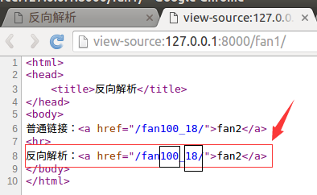

# 验证码

在用户注册、登录页面，为了防止暴力请求，可以加入验证码功能，如果验证码错误，则不需要继续处理，可以减轻业务服务器、数据库服务器的压力。

#### 手动实现验证码

接下来的代码不要求手动写出来，因为这种代码在网上可以搜到很多。

1）安装包Pillow3.4.1。

```
pip install Pillow==3.4.1
```

点击查看[PIL模块API](http://pillow.readthedocs.io/en/3.4.x/)，以下代码中用到了Image、ImageDraw、ImageFont对象及方法。

2）在booktest/views.py文件中，创建视图verify_code。

- 提示1：随机生成字符串后存入session中，用于后续判断。
- 提示2：视图返回mime-type为image/png。

```python
from PIL import Image, ImageDraw, ImageFont
from django.utils.six import BytesIO
...
def verify_code(request):
    #引入随机函数模块
    import random
    #定义变量，用于画面的背景色、宽、高
    bgcolor = (random.randrange(20, 100), random.randrange(
        20, 100), 255)
    width = 100
    height = 25
    #创建画面对象
    im = Image.new('RGB', (width, height), bgcolor)
    #创建画笔对象
    draw = ImageDraw.Draw(im)
    #调用画笔的point()函数绘制噪点
    for i in range(0, 100):
        xy = (random.randrange(0, width), random.randrange(0, height))
        fill = (random.randrange(0, 255), 255, random.randrange(0, 255))
        draw.point(xy, fill=fill)
    #定义验证码的备选值
    str1 = 'ABCD123EFGHIJK456LMNOPQRS789TUVWXYZ0'
    #随机选取4个值作为验证码
    rand_str = ''
    for i in range(0, 4):
        rand_str += str1[random.randrange(0, len(str1))]
    #构造字体对象，ubuntu的字体路径为“/usr/share/fonts/truetype/freefont”
    font = ImageFont.truetype('FreeMono.ttf', 23)
    #构造字体颜色
    fontcolor = (255, random.randrange(0, 255), random.randrange(0, 255))
    #绘制4个字
    draw.text((5, 2), rand_str[0], font=font, fill=fontcolor)
    draw.text((25, 2), rand_str[1], font=font, fill=fontcolor)
    draw.text((50, 2), rand_str[2], font=font, fill=fontcolor)
    draw.text((75, 2), rand_str[3], font=font, fill=fontcolor)
    #释放画笔
    del draw
    #存入session，用于做进一步验证
    request.session['verifycode'] = rand_str
    #内存文件操作
    buf = BytesIO()
    #将图片保存在内存中，文件类型为png
    im.save(buf, 'png')
    #将内存中的图片数据返回给客户端，MIME类型为图片png
    return HttpResponse(buf.getvalue(), 'image/png')
```

3）打开booktest/urls.py文件，配置url。

```
    url(r'^verify_code/$', views.verify_code),
```

4）运行服务器，在浏览器中输入如下网址。

```
http://127.0.0.1:8000/verify_code/
```

5）浏览效果如下图：


可以多刷新几次看值会不会变。

#### 调用验证码

1）在booktest/views.py文件中，创建视图verify_show。

```
def verify_show(request):
    return render(request,'booktest/verify_show.html')
```

2）打开booktest/urls.py文件，配置url。

```
    url(r'^verify_show/$', views.verify_show),
```

3）在templates/booktest/目录下创建verify_show.html。

```
<html>
<head>
    <title>验证码</title>
</head>
<body>
<form method="post" action="/verify_yz/">
    
    <input type="text" name="yzm">
    
    <span id="change">看不清，换一个</span>
    <br>
    <input type="submit" value="提交">
</form>
</body>
</html>
```

4）运行服务器，在浏览器中输入如下网址。

```
http://127.0.0.1:8000/verify_show/
```

5）浏览效果如下图：


#### 验证

1）在booktest/views.py文件中，创建视图verify_yz。

```
def verify_yz(request):
    yzm=request.POST.get('yzm')
    verifycode=request.session['verifycode']
    response=HttpResponse('no')
    if yzm==verifycode:
        response=HttpResponse('ok')
    return response
```

2）打开booktest/urls.py文件，配置url。

```
    url(r'^verify_yz/$', views.verify_yz),
```

3）回到浏览器后刷新，在文本框中填写验证码，点击提交按钮。


4）浏览效果如下图：


---

# 反向解析

#### 先看看原来怎么做

1) 打开booktest/views.py文件，创建视图fan1、fan2。

```
def fan1(request):
    return render(request,'booktest/fan1.html')
def fan2(request):
    return HttpResponse('fan2')
```

2）打开booktest/urls.py文件，配置url。

```
    url(r'^fan1/$', views.fan1),
    url(r'^fan2/$', views.fan2),
```

3）在templates/booktest/目录下创建fan1.html。

```
<html>
<head>
    <title>反向解析</title>
</head>
<body>
普通链接：<a href="/fan2/">fan2</a>
</body>
</html>
```

4）运行服务器，在浏览器中输入如下网址：

```
http://127.0.0.1:8000/fan1/
```

浏览效果如下图：


5）点击链接后转向fan2，效果如下图：



6）打开booktest/urls.py文件，修改"fan2"的正则表达式为"fan_show"。

```
    url(r'^fan_show/$', views.fan2),
```

7）打开浏览器，后退一下，刷新后再次点击链接，浏览如下图：



问题就来了：随着功能的增加会出现更多的视图，可能之前配置的正则表达式不够准确，于是就要修改正则表达式，但是正则表达式一旦修改了，之前所有对应的超链接都要修改，真是一件麻烦的事情，而且可能还会漏掉一些超链接忘记修改，有办法让链接根据正则表达式动态生成吗？ 答：**反向解析**。

> 反向解析应用在两个地方：模板中的超链接，视图中的重定向。

#### 反向解析

要实现反向解析功能，需要如下步骤：

1）在test4/urls.py中为include定义namespace属性。

```
    url(r'^',include('booktest.urls',namespace='booktest')),
```

2）在booktest/urls.py中为url定义name属性，并修改为fan2。

```
    url(r'^fan2/$', views.fan2,name='fan2'),
```

3）在模板中使用url标签做超链接，此处为templates/booktest/fan1.html文件。

```
<html>
<head>
    <title>反向解析</title>
</head>
<body>
普通链接：<a href="/fan2/">fan2</a>
<hr>
反向解析：<a href="">fan2</a>
</body>
</html>
```

4）回到浏览器中，后退，刷新，查看源文件如下图，两个链接地址一样。


5）在booktest/urls.py中，将fan2修改为fan_show。

```
    url(r'^fan_show/$', views.fan2,name='fan2'),
```

6）回到浏览器中，刷新，查看源文件如下图，两个链接地址不一样。


7）反向解析也可以应用在视图的重定向中。

```
from django.shortcuts import redirect
from django.core.urlresolvers import reverse

return redirect(reverse('booktest:fan2'))
```

总结：在定义url时，需要为include定义namespace属性，为url定义name属性，使用时，在模板中使用url标签，在视图中使用reverse函数，根据正则表达式动态生成地址，减轻后期维护成本。

#### URL的参数

有些url配置项正则表达式中是有参数的，接下来讲解如何传递参数。

##### 情况一：位置参数

1）在booktest/urls.py中，修改fan2如下：

```
    url(r'^fan(\d+)_(\d+)/$', views.fan3,name='fan2'),
```

2）在booktest/views中，定义视图fan3如下:

```
def fan3(request, a, b):
    return HttpResponse(a+b)
```

3）修改templates/booktest/fan1.html文件如下：

```
<html>
<head>
    <title>反向解析</title>
</head>
<body>
普通链接：<a href="/fan2_3/">fan2</a>
<hr>
反向解析：<a href="">fan2</a>
</body>
</html>
```

4）回到浏览器中，刷新，查看源文件如下图：



使用重定向传递位置参数格式如下：

```
return redirect(reverse('booktest:fan2', args=(2,3)))
```

##### 情况二：关键字参数

1）在booktest/urls.py中，修改fan2如下：

```
    url(r'^fan(?P<id>\d+)_(?P<age>\d+)/$', views.fan4,name='fan2'),
```

2）在booktest/views中，定义视图fan4如下:

```
def fan4(request, id, age):
    return HttpResponse(id+age)
```

2）修改templates/booktest/fan1.html文件如下：

```
<html>
<head>
    <title>反向解析</title>
</head>
<body>
普通链接：<a href="/fan100_18/">fan2</a>
<hr>
反向解析：<a href="">fan2</a>
</body>
</html>
```

3）回到浏览器中，刷新，查看源文件如下图：



使用重定向传递关键字参数格式如下：

```
return redirect(reverse('booktest:fan2', kwargs={'id':100,'age':18}))
```