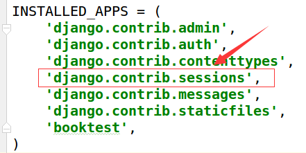

# Session

对于敏感、重要的信息，建议要储在服务器端，不能存储在浏览器中，如用户名、余额、等级、验证码等信息。

> 在服务器端进行状态保持的方案就是Session。

#### 启用Session

Django项目默认启用Session。

打开test3/settings.py文件，在项MIDDLEWARE_CLASSES中启用Session中间件。


禁用Session：将Session中间件删除。

#### 存储方式

打开test3/settings.py文件，设置SESSION_ENGINE项指定Session数据存储的方式，可以存储在数据库、缓存、Redis等。

1）存储在数据库中，如下设置可以写，也可以不写，这是默认存储方式。

```
SESSION_ENGINE='django.contrib.sessions.backends.db'
```

2）存储在缓存中：存储在本机内存中，如果丢失则不能找回，比数据库的方式读写更快。

```
SESSION_ENGINE='django.contrib.sessions.backends.cache'
```

3）混合存储：优先从本机内存中存取，如果没有则从数据库中存取。

```
SESSION_ENGINE='django.contrib.sessions.backends.cached_db'
```

4）如果存储在数据库中，需要在项INSTALLED_APPS中安装Session应用。



5）迁移后会在数据库中创建出存储Session的表。


6）表结构如下图。


> 由表结构可知，操作Session包括三个数据：键，值，过期时间。

#### 依赖于Cookie

所有请求者的Session都会存储在服务器中，服务器如何区分请求者和Session数据的对应关系呢？

答：在使用Session后，会在Cookie中存储一个sessionid的数据，每次请求时浏览器都会将这个数据发给服务器，服务器在接收到sessionid后，会根据这个值找出这个请求者的Session。

结果：如果想使用Session，浏览器必须支持Cookie，否则就无法使用Session了。

存储Session时，键与Cookie中的sessionid相同，值是开发人员设置的键值对信息，进行了base64编码，过期时间由开发人员设置。

#### 对象及方法

通过HttpRequest对象的session属性进行会话的读写操作。

1） 以键值对的格式写session。

```
request.session['键']=值
```

2）根据键读取值。

```
request.session.get('键',默认值)
```

3）清除所有session，在存储中删除值部分。

```
request.session.clear()
```

4）清除session数据，在存储中删除session的整条数据。

```
request.session.flush()
```

5）删除session中的指定键及值，在存储中只删除某个键及对应的值。

```
del request.session['键']
```

6）设置会话的超时时间，如果没有指定过期时间则两个星期后过期。

```
request.session.set_expiry(value)
```

- 如果value是一个整数，会话将在value秒没有活动后过期。
- 如果value为0，那么用户会话的Cookie将在用户的浏览器关闭时过期。
- 如果value为None，那么会话永不过期。

#### 示例

###### 写session

1）打开booktest/views.py文件，创建视图session_test，代码如下：

```
def session_test(request):
    request.session['h1']='hello'
    return HttpResponse('写session')
```

2）打开booktest/urls.py文件，配置url。

```
    url(r'^session_test/$',views.session_test),
```

3）运行服务器，打开浏览器请求如下网址。

```
http://127.0.0.1:8000/session_test/
```

4）浏览效果如下图，在"开发者工具"中可以查看到响应头中创建了Cookie，里面有个键为sessionid。


5）打开MySQL数据库命令行，查询数据如下图。


查看Cookie中的sessionid值为"l48euizwnd0u1vrq401rwc9yqxkj4ip4"，数据表中session的键为“l48euizwnd0u1vrq401rwc9yqxkj4ip4”，是一样的，这样，服务器就可以在众多的请求者中找到对应的Session数据。

在MySQL数据库命令行中复制值，在[Base64解码](http://tool.oschina.net/encrypt?type=3)中进行解码查看如下图。


###### 读session

1）打开booktest/views.py文件，修改session_test视图如下：

```
def session_test(request):
    # request.session['h1']='hello'
    h1=request.session.get('h1')
    return HttpResponse(h1)
```

2）刷新浏览器效果如下图。


###### 删除

1）打开booktest/views.py文件，修改session_test视图如下：

```
def session_test(request):
    # request.session['h1']='hello'
    # h1=request.session.get('h1')
    del request.session['h1']
    return HttpResponse('ok')
```

2）刷新浏览器，在数据库命令行中查询，base64解码后如下图。


如果将所有的键及值都删除，逐个调用del太麻烦，可以使用clear()方法。

###### 删除session

1）打开booktest/views.py文件，修改session_test视图如下：

```
def session_test(request):
    # request.session['h1']='hello'
    # h1=request.session.get('h1')
    # del request.session['h1']
    request.session.flush()
    return HttpResponse('ok')
```

2）刷新浏览器，在数据库命令行中查询如下图。


#### 使用Redis存储Session

会话还支持文件、纯cookie、Memcached、Redis等方式存储，下面演示使用redis存储。

1）安装包。

```
pip install django-redis-sessions==0.5.6
```

2）修改test3/settings文件，增加如下项：

```
SESSION_ENGINE = 'redis_sessions.session'
SESSION_REDIS_HOST = 'localhost'
SESSION_REDIS_PORT = 6379
SESSION_REDIS_DB = 2
SESSION_REDIS_PASSWORD = ''
SESSION_REDIS_PREFIX = 'session'
```

3）打开booktest/views.py文件，修改session_test视图如下：

```
def session_test(request):
    request.session['h1']='hello'
    # h1=request.session.get('h1')
    # del request.session['h1']
    # request.session.flush()
    return HttpResponse('ok')
```

4）管理redis的命令，需要保证redis服务被开启。

```
查看：ps ajx|grep redis
启动：sudo service redis start
停止：sudo service redis stop
使用客户端连接服务器：redis-cli
切换数据库：select 2
查看所有的键：keys *
获取指定键的值：get name
```

5）刷新浏览器，在redis客户端中查看数据如下。

