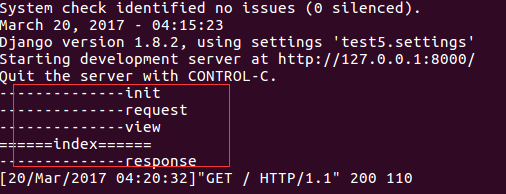

# 中间件

Django中的中间件是一个轻量级、底层的插件系统，可以介入Django的请求和响应处理过程，修改Django的输入或输出。中间件的设计为开发者提供了一种无侵入式的开发方式，增强了Django框架的健壮性，其它的MVC框架也有这个功能，名称为IoC。

Django在中间件中预置了五个方法，这五个方法的区别在于不同的阶段执行，对输入或输出进行干预，方法如下：


> ！！！！！！！！！！！！！！！！！！！！！！！！！！！！！！！！！
>
> 这4个步骤（不算init），若无返回Httpresponse，则按照顺序自动调用，若中间任何一步有返回，那后面的都不执行了

1）初始化：无需任何参数，服务器响应第一个请求的时候调用一次，用于确定是否启用当前中间件。

```
def __init__(self):
    pass
```

2）处理请求前：在每个请求上，request对象产生之后，url匹配之前调用，返回None或HttpResponse对象。

```
def process_request(self, request):
    pass
```

3）处理视图前：在每个请求上，url匹配之后，视图函数调用之前调用，返回None或HttpResponse对象。

```
def process_view(self, request, view_func, *view_args, **view_kwargs):
    pass
```

4）处理响应后：视图函数调用之后，所有响应返回浏览器之前被调用，在每个请求上调用，返回HttpResponse对象。

```
def process_response(self, request, response):
    pass
```

5）异常处理：当视图抛出异常时调用，在每个请求上调用，返回一个HttpResponse对象。

```
def process_exception(self, request,exception):
    pass
```

#### 使用步骤

中间件是一个独立的python类，，可以定义这五个方法中的一个或多个。

1）在booktest/目录下创建middleware.py文件，代码如下：

```
class my_mid:
    def __init__(self):
        print '--------------init'

    def process_request(self,request):
        print '--------------request'

    def process_view(self,request, view_func, *view_args, **view_kwargs):
        print '--------------view'

    def process_response(self,request, response):
        print '--------------response'
        return response
```

2）在test5/settings.py文件中，向MIDDLEWARE_CLASSES项中注册。


3）修改booktest/views.py中视图index。

```
def index(request):
    print '======index======'
    return render(request,'booktest/index.html')
```

4）运行服务器，命令行中效果如下图：



3）刷新页面，命令行中效果如下图：


#### 异常中间件

1）在booktest/middleware.py中定义两个异常类如下：

```
class exp1:
    def process_exception(self,request,exception):
        print '--------------exp1'
class exp2:
    def process_exception(self,request,exception):
        print '--------------exp2'
```

2）在test5/settings.py文件中，向MIDDLEWARE_CLASSES项中注册。


3）修改booktest/views.py中视图index。

```
def index(request):
    print '======index======'
    raise Exception('自定义异常')
    return render(request,'booktest/index.html')
```

结果：exp2先打印出错误

总结：如果多个注册的中间件类中都有process_exception的方法，则先注册的后执行。