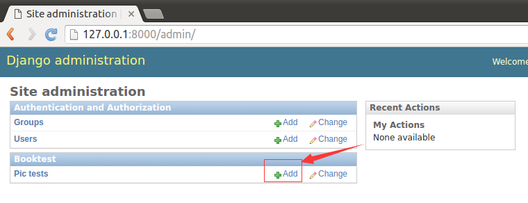
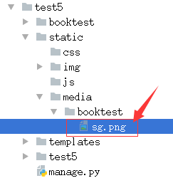

# 上传图片

在python中进行图片操作，需要安装包PIL。

```
pip install Pillow==3.4.1
```

在Django中上传图片包括两种方式：

- 在管理页面admin中上传图片
- 自定义form表单中上传图片

上传图片后，将图片存储在服务器上，然后将图片的路径存储在表中。

## 创建包含图片的模型类

将模型类的属性定义成models.ImageField类型。

1）打开booktest/models.py文件，定义模型类PicTest。

```
class PicTest(models.Model):
    pic = models.ImageField(upload_to='booktest/')
```

2）回到命令行中，生成迁移。

```
python manage.py makemigrations
```

3）打开booktest/migrations/0001_initial.py文件，删除AreaInfo部分，因为这个表已经存在。

.png)

4）回到命令行中，执行迁移。

```
python manage.py migrate
```

5）因为当前没有定义图书、英雄模型类，会提示“是否删除”，输入“no”后回车，表示不删除。


6）打开test5/settings.py文件，设置图片保存路径。

因为图片也属于静态文件，所以保存到static目录下。

```
MEDIA_ROOT=os.path.join(BASE_DIR,"static/media")
```

7）在static目录下创建media目录，再创建应用名称的目录，此例为booktest。


## 在管理页面admin中上传图片

1）打开booktest/admin.py文件，注册PicTest。

```
from django.contrib import admin
from booktest.models import *

admin.site.register(PicTest)
```

2）运行服务器，输入如下网址。

```
http://127.0.0.1:8000/admin/
```



3）点击“Add”添加数据，打开新页面。


4）选择图片，点击“save”按钮完成图片上传。 5）回到数据库命令行，查询表pictest中的数据如下图：


6）图片被保存到目录static/media/booktest/下，如下图：



# 显示图片

1）打开booktest/views.py文件，创建视图pic_show。

```
from booktest.models import PicTest
...
def pic_show(request):
    pic=PicTest.objects.get(pk=1)
    context={'pic':pic}
    return render(request,'booktest/pic_show.html',context)
```

2）打开booktest/urls.py文件，配置url。

```
    url(r'^pic_show/$', views.pic_show),
```

3）在templates/booktest/目录下创建模板pic_show.html。

```
<html>
<head>
    <title>显示上传的图片</title>
</head>
<body>

</body>
</html>
```