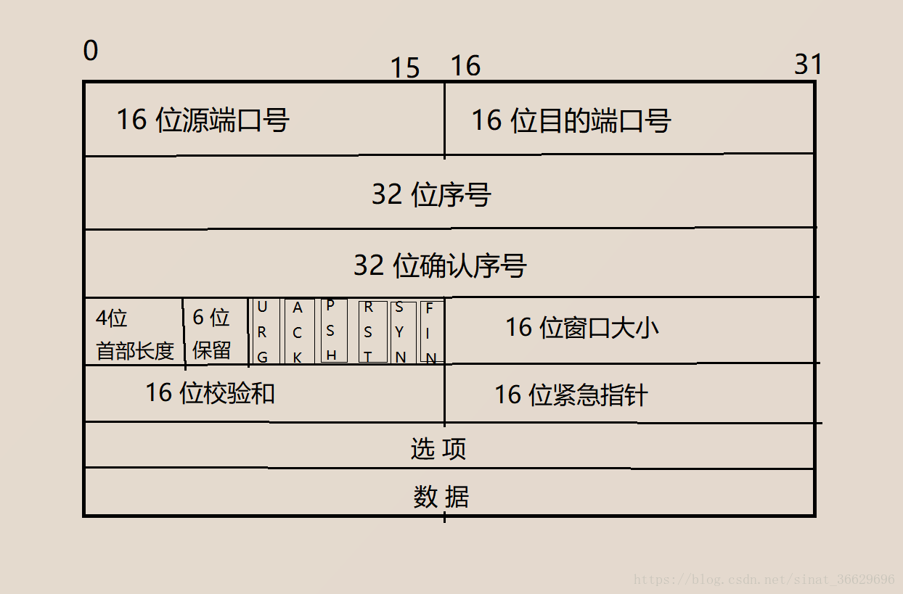
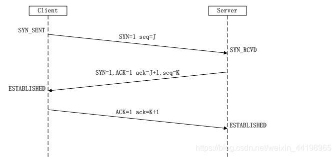

# TCP

---

## TCP使用固定的连接

TCP 用于应用程序之间的通信。

当应用程序希望通过 TCP 与另一个应用程序通信时，它会发送一个通信请求。这个请求必须被送到一个确切的地址。在双方“握手”之后，TCP 将在两个应用程序之间建立一个全双工 (full-duplex) 的通信。

这个全双工的通信将占用两个计算机之间的通信线路，直到它被一方或双方关闭为止。

UDP 和 TCP 很相似，但是更简单，同时可靠性低于 TCP。

---

## TCP的结构

> 图中的16位、32位等是bit，1byte=bit，编程接收时str a[1] 一个字符数组是一个byte

- 16位源端口号：
  
  - 16位的源端口中包含初始化通信的端口。源端口和源IP地址的作用是标识报文的返回地址。

- 16位目的端口号：
  
  - 16位的目的端口域定义传输的目的。这个端口指明报文接收计算机上的应用程序地址接口。

- 32位序号：
  
  - 32位的序列号由接收端计算机使用，重新分段的报文成最初形式。当SYN出现，序列码实际上是初始序列码（Initial Sequence Number，ISN），而第一个数据字节是ISN+1。这个序列号（序列码）可用来补偿传输中的不一致。

- 32位确认序号：
  
  - 32位的序列号由接收端计算机使用，重组分段的报文成最初形式。如果设置了ACK控制位，这个值表示一个准备接收的包的序列码。

- 4位首部长度: 
  
  - 表示该tcp报头有多少个4字节(32个bit)

- 保留（6位）：
  
  - 6位值域，这些位必须是0。为了将来定义新的用途而保留。顾名思义, 先保留着, 以防万一

- URG:紧急标志- 标识紧急指针是否有效
  ACK: 有意义的应答标志-标识确认序号是否有效
  PSH: 推-用来提示接收端应用程序立刻将数据从tcp缓冲区读走
  RST: 重置连接标志-要求重新建立连接. 我们把含有RST标识的报文称为复位报文段
  SYN: 同步序列号标志-请求建立连接. 我们把含有SYN标识的报文称为同步报文段
  FIN: 完成发送数据标志-通知对端, 本端即将关闭. 我们把含有FIN标识的报文称为结束报文段

- 16位窗口大小:
  
  - 用来表示想收到的每个TCP数据段的大小。TCP的流量控制由连接的每一端通过声明的窗口大小来提供。窗口大小为字节数，起始于确认序号字段指明的值，这个值是接收端正期望接收的字节。窗口大小是一个16字节字段，因而窗口大小最大为65535字节。

- 16位检验和: 
  
  - 由发送端填充, 检验形式有CRC校验等. 如果接收端校验不通过, 则认为数据有问题. 此处的校验和不光包含TCP首部, 也包含TCP数据部分.

- 16位紧急指针: 
  
  - 用来标识哪部分数据是紧急数据.
    选项和数据暂时忽略

---

## 三次握手

所谓三次握手（Three-Way Handshake）即建立TCP连接，就是指建立一个TCP连接时，需要客户端和服务端总共发送3个包以确认连接的建立。在socket编程中，这一过程由客户端执行connect来触发，整个流程如下所示：

- 第一次:
  
  - 客户端 - - > 服务器 此时服务器知道了客户端要建立连接了

- 第二次:
  
  - 客户端 < - - 服务器 此时客户端知道服务器收到连接请求了

- 第三次:
  
  - 客户端 - - > 服务器 此时服务器知道客户端收到了自己的回应

到这里, 就可以认为客户端与服务器已经建立了连接.

- 第一次握手：
  
  - Client将标志位SYN置为1，随机产生一个值seq=J，并将该数据包发送给Server，Client进入SYN_SENT状态，等待Server确认。

- 第二次握手：
  
  - Server收到数据包后由标志位SYN=1知道Client请求建立连接，Server将标志位SYN和ACK都置为1，ack=J+1，随机产生一个值seq=K，并将该数据包发送给Client以确认连接请求，Server进入SYN_RCVD状态。

- 第三次握手：
  
  - Client收到确认后，检查ack是否为J+1，ACK是否为1，如果正确则将标志位ACK置为1，ack=K+1，并将该数据包发送给Server，Server检查ack是否为K+1，ACK是否为1，如果正确则连接建立成功，Client和Server进入ESTABLISHED状态，完成三次握手，随后Client与Server之间可以开始传输数据了。

#### 为什么不用两次?

主要是为了防止已经失效的连接请求报文突然又传送到了服务器，从而产生错误。

> 如果使用的是两次握手建立连接，假设有这样一种场景，客户端发送的第一个请求连接并且没有丢失，只是因为在网络中滞留的时间太长了，由于TCP的客户端迟迟没有收到确认报文，以为服务器没有收到，此时重新向服务器发送这条报文，此后客户端和服务器经过两次握手完成连接，传输数据，然后关闭连接。此时之前滞留的那一次请求连接，因为网络通畅了, 到达了服务器，这个报文本该是失效的，但是，两次握手的机制将会让客户端和服务器再次建立连接，这将导致不必要的错误和资源的费。
> 如果采用的是三次握手，就算是那一次失效的报文传送过来了，服务端接受到了那条失效报文并且回复了确认报文，但是客户端不会再次发出确认。由于服务器收不到确认，就知道客户端并没有请求连接。

#### 为什么不用四次?

因为三次已经可以满足需要了, 四次就多余了.

#### SYN攻击：

> 在三次握手过程中，Server发送SYN-ACK之后，收到Client的ACK之前的TCP连接称为半连接（half-open connect），此时Server处于SYN_RCVD状态，当收到ACK后，Server转入ESTABLISHED状态。SYN攻击就是Client在短时间内伪造大量不存在的IP地址，并向Server不断地发送SYN包，Server回复确认包，并等待Client的确认，由于源地址是不存在的，因此，Server需要不断重发直至超时，这些伪造的SYN包将产时间占用未连接队列，导致正常的SYN请求因为队列满而被丢弃，从而引起网络堵塞甚至系统瘫痪。SYN攻击时一种典型的DDOS攻击，检测SYN攻击的方式非常简单，即当Server上有大量半连接状态且源IP地址是随机的，则可以断定遭到SYN攻击了，使用如下命令可以让之现行：

    #netstat -nap | grep SYN_RECV

---

## 四次挥手

所谓四次挥手（Four-Way Wavehand）即终止TCP连接，就是指断开一个TCP连接时，需要客户端和服务端总共发送4个包以确认连接的断开。在socket编程中，这一过程由客户端或服务端任一方执行close来触发，整个流程如下所示：

数据传输完毕后，双方都可以释放连接.
此时客户端和服务器都是处于ESTABLISHED状态，然后客户端主动断开连接，服务器被动断开连接.

- 客户端进程发出连接释放报文，并且停止发送数据。
  释放数据报文首部，FIN=1，其序列号为seq=u（等于前面已经传送过来的数据的最后一个字节的序号加1），此时客户端进入FIN-WAIT-1（终止等待1）状态。 TCP规定，FIN报文段即使不携带数据，也要消耗一个序号。

- 服务器收到连接释放报文，发出确认报文，ACK=1，确认序号为 u+1，并且带上自己的序列号seq=v，此时服务端就进入了CLOSE-WAIT（关闭等待）状态。
  TCP服务器通知高层的应用进程，客户端向服务器的方向就释放了，这时候处于半关闭状态，即客户端已经没有数据要发送了，但是服务器若发送数据，客户端依然要接受。这个状态还要持续一段时间，也就是整个CLOSE-WAIT状态持续的时间。

- 客户端收到服务器的确认请求后，此时客户端就进入FIN-WAIT-2（终止等待2）状态，等待服务器发送连接释放报文（在这之前还需要接受服务器发送的最终数据）

- 服务器将最后的数据发送完毕后，就向客户端发送连接释放报文，FIN=1，确认序号为v+1，由于在半关闭状态，服务器很可能又发送了一些数据，假定此时的序列号为seq=w，此时，服务器就进入了LAST-ACK（最后确认）状态，等待客户端的确认。
- 客户端收到服务器的连接释放报文后，必须发出确认，ACK=1，确认序号为w+1，而自己的序列号是u+1，此时，客户端就进入了TIME-WAIT（时间等待）状态。注意此时TCP连接还没有释放，必须经过2∗MSL（最长报文段寿命）的时间后，当客户端撤销相应的TCB后，才进入CLOSED状态。
- 服务器只要收到了客户端发出的确认，立即进入CLOSED状态。同样，撤销TCB后，就结束了这次的TCP连接。可以看到，服务器结束TCP连接的时间要比客户端早一些。

> 建立一个连接需要三次握手，而终止一个连接要经过 4次握手。这由T C P的半关闭（h a l f - c l o s e）造成的。既然一个T C P连接是全双工（即数据在两个方向上能同时传递），因此每个方 向必须单独地进行关闭。这原则就是当一方完成它的数据发送任务后就能发送一个 F I N来终止 这个方向连接。当一端收到一个 F I N，它必须通知应用层另一端几经终止了那个方向的数据传 送。发送F I N通常是应用层进行关闭的结果。

#### 为什么最后客户端还要等待 2*MSL的时间呢?

MSL（Maximum Segment Lifetime），TCP允许不同的实现可以设置不同的MSL值。

- 第一，保证客户端发送的最后一个ACK报文能够到达服务器，因为这个ACK报文可能丢失，站在服务器的角度看来，我已经发送了FIN+ACK报文请求断开了，客户端还没有给我回应，应该是我发送的请求断开报文它没有收到，于是服务器又会重新发送一次，而客户端就能在这个2MSL时间段内收到这个重传的报文，接着给出回应报文，并且会重启2MSL计时器。

- 第二，防止类似与“三次握手”中提到了的“已经失效的连接请求报文段”出现在本连接中。客户端发送完最后一个确认报文后，在这个2MSL时间中，就可以使本连接持续的时间内所产生的所有报文段都从网络中消失。这样新的连接中不会出现旧连接的请求报文。
  
  > 再说第二点，如果Client直接CLOSED，然后又再向Server发起一个新连接，我们不能保证这个新连接与刚关闭的连接的端口号是不同的。也就是说有可能新连接和老连接的端口号是相同的。一般来说不会发生什么问题，但是还是有特殊情况出现：假设新连接和已经关闭的老连接端口号是一样的，如果前一次连接的某些数据仍然滞留在网络中，这些延迟数据在建立新连接之后才到达Server，由于新连接和老连接的端口号是一样的，又因为TCP协议判断不同连接的依据是socket pair，于是，TCP协议就认为那个延迟的数据是属于新连接的，这样就和真正的新连接的数据包发生混淆了。所以TCP连接还要在TIME_WAIT状态等待2倍MSL，这样可以保证本次连接的所有数据都从网络中消失。
  > 

